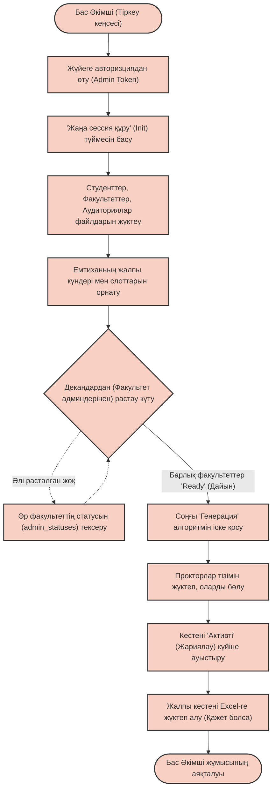
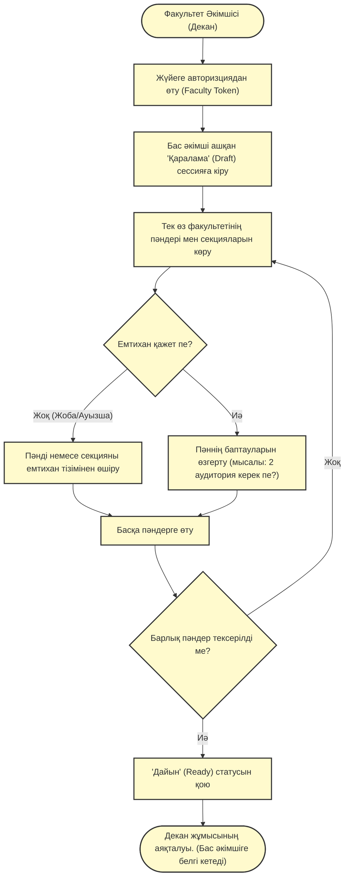
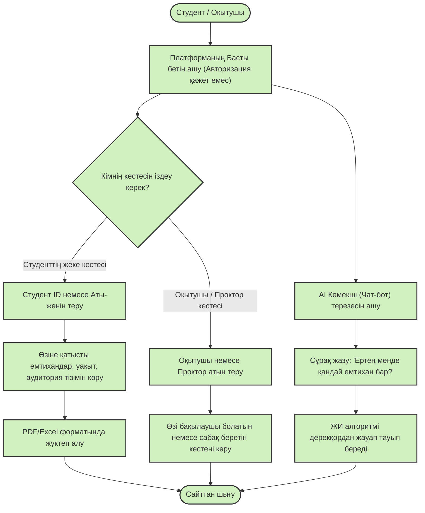

# Жүйенің User Flow (Рөлдер бойынша Пайдаланушы сценарийлері)

Бұл құжатта жүйенің әрбір негізгі пайдаланушысы үшін (Бас Әкімші, Факультет Әкімшісі, Студент/Оқытушы) жеке-жеке құрылған ұсыныстық блок-схемалар (User Flow) және олардың толық мәтіндік сипаттамасы берілген. Бұл ақпарат жүйенің архитектурасы мен жұмыс істеу логикасын түсіндіру үшін қолданылады.

---

## 1. Бас Әкімші (Тіркеу кеңсесі / Registrar)
**Сипаттама:** Бас әкімші – жүйенің ең жоғарғы рұқсатына ие пайдаланушы. Бұл рөлге негізінен университеттегі оқу процесін жаппай бақылайтын Тіркеу кеңсесінің (Офис регистратор) қызметкерлері ие болады. Бас әкімшінің басты міндеті – жаңа емтихан сессиясын бастау, бастапқы базалық мәліметтерді жүйеге енгізу және факультеттерден тексеру нәтижесі келгеннен кейін барып, бүкіл университет бойынша ортақ емтихан кестесін генерациялау.

**Жұмыс алгоритмі (Қадамдар):**
1. **Жүйеге кіру:** Бас әкімші жүйеге кіру парақшасында өзінің корпоративтік логині мен құпиясөзін (Admin Token) енгізеді.
2. **Сессияны бастау:** Басты панельдегі "Жаңа сессия құру" функциясын таңдайды.
3. **Деректерді импорттау:** Студенттердің контингенті, пәндер тізімі және университеттегі барлық бос аудиториялардың тізімі бар Excel немесе CSV файлдарын жүйеге жүктейді.
4. **Уақыт шеңберін бекіту:** Алдағы емтихандар өтетін күндер аралығын (мысалы, 10 мамыр мен 25 мамыр) және стандартты уақыт слоттарын (мысалы: 09:00, 11:30, 14:00) орнатады.
5. **Деканаттарды күту:** Осы кезде кестенің алғашқы қараламасы (Draft) жасалады. Бас әкімші автоматты алгоритмді іске қоспас бұрын, әр факультеттің өзіне тиесілі пәндерді растағанын (күту режимі) қадағалайды. Ол жүйеден әр факультеттің баптауды аяқтаған немесе аяқтамаған "статусын" көріп отырады.
6. **Генерациялау:** Барлық факультеттер "Дайын" (Ready) статусын берген кезде, бас әкімші "Автоматты генерация" процесін іске қосады. Жүйе қақтығыстарды толықтай шешіп, кестені құрастырады.
7. **Прокторларды бөлу:** Кесте құрылып біткен соң, прокторлардың базасын жүктеп, әр емтиханға бақылаушыларды автоматты түрде тағайындайды.
8. **Жариялау:** Кестенің толық нұсқасы тексерілгеннен кейін оны "Активті" күйге ауыстырып, бүкіл студенттер мен оқытушылардың көруіне қолжетімді етеді. Қажет болған жағдайда есеп беруге арналған Excel форматындағы жалпы кестені жүктеп алады.

---

## 2. Факультет Әкімшісі (Декан / Деканат қызметкері)
**Сипаттама:** Факультет әкімшісі (Деканат) – жүйеде орташа рұқсат деңгейіне ие пайдаланушы. Тіркеу кеңсесі жалпы сессияны ашқаннан кейін, деканат қызметкері өз факультетінің пәндерін қадағалау мақсатында жүйеге кіреді. Оның басты міндеті – емтихан қажет етпейтін пәндерді (ауызша емтихан, жоба қорғау немесе практикалық сабақтар) тізімнен алып тастау және нақты конфигурацияларды орнату. Бұл қадам жалпы алгоритмнің артық жұмыс істеуін болдырмайды.

**Жұмыс алгоритмі (Қадамдар):**
1. **Жүйеге кіру:** Деканат қызметкері өз логинімен (Faculty Token) жүйеге кіреді.
2. **Қаралама кестені ашу:** Бас әкімші жүктеген жаңа сессияның "Қаралама" (Draft) нұсқасына өтеді. Жүйе осы пайдаланушыға тек өз факультетіне бекітілген пәндер мен секцияларды ғана көрсетеді (басқа факультеттерді көре алмайды).
3. **Пәндерге ревизия жасау:** Әр пәнге жеке-жеке кіріп: "Бұл пәннен дәстүрлі жазбаша емтихан өте ме?" деген сұраққа жауап береді.
4. **Өзгерістер енгізу:**
   - Егер пән емтихан қажет етпесе (мысалы, "Курстық жұмыс"), оны кестені жоспарлау тізімінен біржолата алып тастайды.
   - Егер емтихан өтетін болса, қосымша конфигурацияларды (мысалы: "Бұл пәнге 1 емес, 2 аудитория қажет" немесе "Арнайы компьютерлік сынып керек") орнатады.
5. **Растау және аяқтау:** Деканат барлық пәндері бойынша тексеріс жасап болған соң, жүйедегі "Дайын" (Ready) түймесін басады. Осыдан кейін бұл факультет үшін өзгерістер жабылады да, Бас әкімшіге (Тіркеу кеңсесіне) "Оқу орындалды, генерацияға дайын" деген сигнал кетеді.

---

## 3. Қарапайым Пайдаланушы (Студент / Оқытушы)
**Сипаттама:** Бұл жүйенің ең көлемді пайдаланушылар тобы. Студенттер мен оқытушылар жүйеге тек кесте генерацияланып, толық бекітілген соң ("Жарияланған" күйге өткенде) ғана кіре алады. Олардың негізгі мақсаты – ақпаратты кедергісіз, жылдам әрі қатесіз алу. Жүйе оларға іздеу жүйесін және болашақтағы ЖИ чат-ботты ұсынады.

**Жұмыс алгоритмі (Қадамдар):**
1. **Платформаны ашу:** Студент немесе оқытушы платформаның басты бетіне (студенттік порталға) браузер арқылы кіреді. Бұл жерде күрделі авторизациядан өтудің қажеті жоқ (түрлі мәселелерді болдырмау үшін ашық іздеу ұсынылуы мүмкін).
2. **Жеке кестені іздеу:** 
   - Пайдаланушы "Студент" немесе "Оқытушы" санатын таңдап, іздеу жолағына өзінің бірегей ID нөмірін (немесе аты-жөнін) жазады.
3. **Ақпаратты көру және жүктеп алу:** 
   - Жүйе студентке тек өзінің оқу траекториясындағы (жазылған пәндеріндегі) емтихандарды, олардың күнін, уақытын, мұғалімін және аудитория нөмірін көрсетеді. 
   - Мыңдаған жолдан тұратын үлкен Excel файлынан өзін іздемей-ақ, фильтр арқылы алдағы емтихандарының кезегін көріп, дайын жеке кестесін PDF/Excel форматында құрылғысына бірден жүктеп алады.
4. **ЖИ чат-ботты пайдалану (Болашақ интеграция):**
   - Егер студентке интерфейс арқылы іздегеннен гөрі сұрау ыңғайлырақ болса, ол сайт бұрышындағы AI чатын ашады.
   - *"Менің ертең қандай емтиханым бар?"* немесе *"Математика қай кабинетте?"* деп табиғи тілде мәтін жазады.
   - Жасанды интеллект көмекшісі API арқылы деректер қорына қосылып, студенттің жеке профиліндегі мәліметтер негізінде сапалы, нақты және лезде жауап береді. (Мысалы: *"Ертең сағат 09:00-де Математика пәні, 107-аудитория"*).
   - Егер Тіркеу кеңсесі кенеттен аудиторияны ауыстырса немесе уақытты өзгертсе, ЖИ чат-бот бұл туралы студентке автоматты үзінді-хабарлама (Notification) жібереді.

